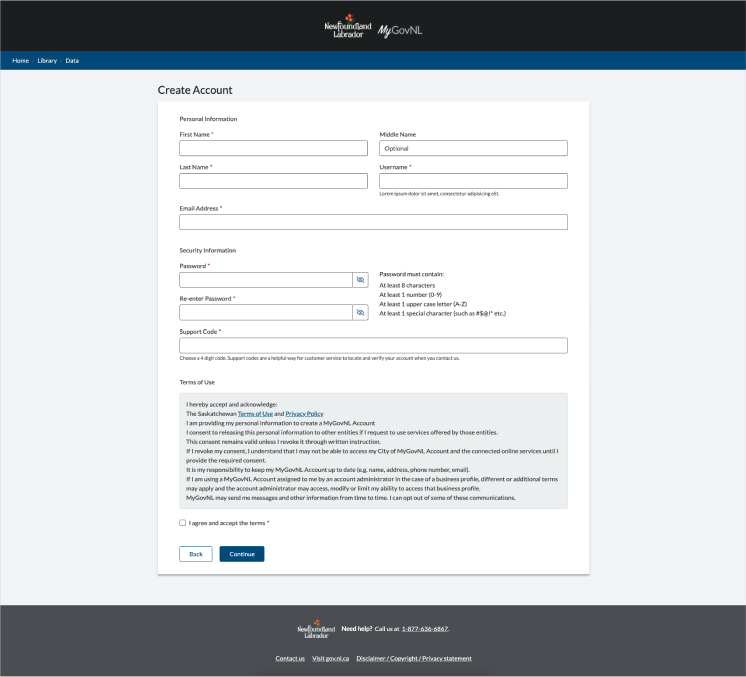
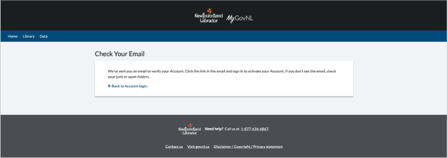

#Create Account

###Login

 
###Create Account

When the user fills the form and clicks on "Continue" a confirmation email is being sent, and the user is being informed with "Check your email" screen
###Check Your Email

### Email being send:
Hi Bea,

You recently created a MyGovNL Account.

Click this link to sign in and activate your MyGovNL Account.

If the above link is not clickable, copy and paste this link into your web browser's address bar:

https://gov.nl.ca/#/activate/5hpfhp6qqk9875vlt36m8abc41c2f8du6pc67c74m5j6kth9

Regards,

Government of Newfoundland and Labrador

This message including attachments was sent to bea@vivvo.com for a specific recipient. If you are not the intended recipient, any redistribution or copying of this message is prohibited. If you have received this email in error, please let us know immediately, and delete this email.
