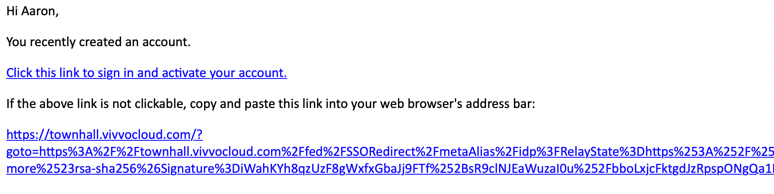

#####################
Template design guide
#####################

| This page acts as a guide to any front-end designers that intend to edit the pages below.
| Each section (or page) explains exactly what the back end is expecting the page to contain/send back in order for it to work.
| Anything else on the page is under your creative control, and can be changed without issue.

*****
Login
*****

The Login page must contain a form with the following inputs

    - Email or Username
    - Password

Sample POST Body Object:

.. code-block:: JSON
   :linenos:

    {
        "csrf_token": "8c1807936b8753970dceb15a38850b35b4a909585bbdfa7181d4a6a9bda91b10",
        "UserNameOrEmail": "sherlock@holmes.com",
        "Password": "Elementary25!"
    }

| The Login page often acts as the home/landing page.
| When the user hits ``Submit`` the form will POST to ``/registration/create``.
| It usually also contains links to the ``Create Account`` and ``Forgot Password`` pages.

**************
Create Account
**************

The Create Account page must contain a form with the following inputs

    - First name
    - Last name
    - Username
    - Email
    - Password
    - Accepted Terms of use (checkbox)
    - csrf_token (hidden)

Sample POST Body Object:

.. code-block:: JSON
   :linenos:

    {
        "csrf_token": "8c1807936b8753970dceb15a38850b35b4a909585bbdfa7181d4a6a9bda91b10",
        "FirstName": "Sherlock",
        "LastName": "Holmes",
        "UserName": "SherlockH",
        "EmailAddress": "sherlock@holmes.com",
        "ConfirmEmailAddress": "sherlock@holmes.com",
        "Password": "Elementary25!",
        "ConfirmPassword": "Elementary25!",
        "AcceptTermsAndConditions": "true"
    }

Sample form inputs:

.. code-block:: HTML
   :linenos:

    Form Input Fields:
        <input type="text" maxlength="30" name="FirstName" value="" aria-label="First name">
        <input type="text" maxlength="50" name="LastName" value="" aria-label="Last name">
        <input type="text" maxlength="70" name="UserName" value="" aria-label="User name">
        <input type="email" maxlength="70" name="EmailAddress" value="" aria-label="Email Address">
        <input type="email" maxlength="70" name="ConfirmEmailAddress" value="" aria-label="Confirm Email Address">
        <input type="password" minlength="8" maxlength="128" name="Password" value="" aria-label="Password">
        <input type="password" minlength="8" maxlength="128" name="ConfirmPassword" value="" aria-label="Confirm Password">
        <input type="checkbox" name="AcceptTermsAndConditions" value="Y" aria-label="Accept terms and conditions">

    Hidden csrf token:
        <input id="csrfToken" type="hidden" name="csrf_token" value="{{ $token }}"/>

As long as the form has name attributes on each input, and the form's action is set to
``/registration/create``
, then we will populate the ``csrf_token`` input, and create an account with the given details on submit.

| **Note** that in order to protect against `cross-site request forgery <https://portswigger.net/web-security/csrf>`_, we require a ``csrf_token``.
| This token is generated by our application, attached to user sessions, and must accompany relevant requests in order to avoid a csrf error.

Email Template
==============

| After submitting the ``Create Account`` form, the user will receive an invitation to activate their account.
| The invitation is html driven, and highly customizable.

Sample template:

.. code-block:: HTML
   :linenos:

   <link href="https://fonts.googleapis.com/css?family=Source+Sans+Pro:400,700" rel="stylesheet">
   
   <header style="clear: both;">
       
   </header>
   <main style="clear: both;">
       

           
Hi $firstName,

           
You recently created an account.

           
<a href="$activationLink">Click this link to sign in and activate your account.</a>

           
If the above link is not clickable, copy and paste this link into your web browser's address bar:

           
$activationLink

       

   </main>

Email Sent
==========

The Email Sent page generally directs users to check their emails for an invitation to the website.

This page can optionally display the email address that the invitation has been sent to, as well as other account details.

Email Verified (optional)
=========================

| In the invitation in the email, you have the option of supplying a ``goto`` link.
| The user will be redirected to the ``goto`` link after verifying their account.

| This ``Email Verified`` page generally tells the user that their account has been verified successfully, and offers a link to the login page.
| You can also omit the ``Email Verified`` page, leave the ``goto`` link blank, and the user will land on ``Login`` instead.

*********
Dashboard
*********

The Dashboard page has no primary action, but it does display a number of important values to the user.
Those values are:

- `maintenanceMessage`
   - A maintenance message that can be enabled or disabled to notify users of planned maintenance downtime.
   - Structure:
      .. code-block:: JSON
         :linenos:

         {
            "maintenanceId",
            "title",
            "details",
            "startDate",
            "endDate"
         }

- `ServiceCards`
   - A list of service card the user is subscribed to.
   - Structure:
      .. code-block:: JSON
          :linenos:

          {
             "identityServiceCardId",
             "identityId",
             "serviceCardId",
             "sortOrder",
             "serviceCard",
             "lightServiceCard",
             "notificationCount"
          }

- `notificationCount`
   - The amount of unread notifications for the user
- `initials`
   - The first and last initials of the user. For example, a user named Sherlock Holmes would receive S.H.
- `primaryEmail`
   - The primary email of the user.

*************
Notifications
*************

The primary action of the Notification is to display the list of notifications in the users INBOX and the list of notifications in the users notification ARCHIVE.
Additionally, the user may be able to move notifications from their inbox to their archived notifications.

The `DataTables <https://datatables.net/>`_ plugin is used to display the users notifications and archived notifications.
Both templates must follow this format.

The Notifications requires the following hidden input to move notifications from the users INBOX to ARCHIVE:

    - csrf_token (hidden)

Sample POST URL:

``/c1/en/dashboard/services/notification/12345/move?csrf_token=8c1807936b8753970dceb15a38850b35b4a909585bbdfa7181d4a6a9bda91b10&folderType=ARCHIVE``

Sample form inputs:

.. code-block:: HTML
   :linenos:

    Hidden csrf token:
        <input id="csrfToken" type="hidden" name="csrf_token" value="{{ $token }}"/>

- `Notifications and Archived Notifications`
   - A list of notifications that have been sent to the user.
   - Structure:
      .. code-block:: JSON
          :linenos:

          {
              "notificationId",
              "applicationName",
              "organizationName",
              "subject",
              "body",
              "notificationDate",
              "status",
              "folderType",
              "referenceNumber",
              "recipient"
          }

***************
Forgot Password
***************

The Forgot password page must contain a form with the following inputs

    - Email
    - csrf_token (hidden)

Sample POST Body Object:

.. code-block:: JSON
   :linenos:

    {
        "csrf_token": "8c1807936b8753970dceb15a38850b35b4a909585bbdfa7181d4a6a9bda91b10",
        "EmailAddress": "sherlock@holmes.com",
    }

Sample form inputs:

.. code-block:: HTML
   :linenos:

    Form Input Fields:
        <input type="email" maxlength="70" name="EmailAddress" value="" aria-label="Email Address">

    Hidden csrf token:
        <input id="csrfToken" type="hidden" name="csrf_token" value="{{ $token }}"/>

As long as the form has inputs with name attributes that match the samples above, and the form's action is set to
``/en/recovery/``
, the ``csrf_token`` input will be populated, and the user will be sent a password recovery email.

********************
Terms and Conditions
********************

| The Terms and Conditions page displays the most up to date version of the Terms and Conditions connected to the application's policy in Citizen One.
| To update the terms displayed, new markup or plain text can be entered into the Management application

*******
Account
*******

The pages in this section all have access to the following variables:

.. code-block::
    :linenos:

    primaryEmail
    me
    pageName

me

.. code-block:: JSON
   :linenos:

    {
        Identity           Identity
        Business           string
        HasBusinessConnect bool
        RedirectUrls       Link[]
    }

Identity

.. code-block:: JSON
   :linenos:

   {
        IdentityId               string
        FirstName                string
        LastName                 string
        MiddleName               string
        UserName                 string
        Salutation               string
        DateOfBirth              string
        SupportCode              string
        AssuranceLevel           AssuranceLevel
        Emails                   Email[]
        Phones                   Phone[]
        Addresses                Address[]
        SecondaryAuthentications SecondaryAuthentication[]
        ExternalIdentifiers      ExternalIdentifiers[]
   }

Security
========

===============
Change Password
===============

| The Change Password page must contain a form with the following inputs:

- CurrentPassword
- Password
- VerifyPassword
- csrf_token (hidden)

Sample POST Body Object:

.. code-block:: JSON
   :linenos:

    {
        "csrf_token": "8c1807936b8753970dceb15a38850b35b4a909585bbdfa7181d4a6a9bda91b10",
        "CurrentPassword": "Elementary25!",
        "Password": "Watson44!",
        "VerifyPassword": "Watson44!",
    }

Sample form inputs:

.. code-block:: HTML
   :linenos:

    Form Input Fields:
        <input type="password" name="CurrentPassword" value="" aria-label="Current password">
        <input type="password" name="Password" value="" aria-label="New password">
        <input type="password" name="VerifyPassword" value="" aria-label="Verify new password">

    Hidden csrf token:
        <input id="csrfToken" type="hidden" name="csrf_token" value="{{ $token }}"/>

As long as the form has name attributes on each input, and the form's action is set to
``/c1/en/dashboard/profile/updatePassword``
, then we will populate the ``csrf_token`` input, and reset the user's password with the new one supplied.

Afterwards, the user is redirected to a Success screen at `/dashboard/profile/updatePassword`, where after a few seconds, they will be signed out.

Profile
=======
.. _profile:
| The Profile page has no primary action of its own, but it is supplied with the following additional variables:

.. code-block::
    :linenos:

    parentPage
    passwordChangeDate
    maintenanceMessage

| It also leads to several sub-pages that allow the user to take actions on their account, which are listed below.

====================
Your email addresses
====================

The Your Email addresses page has no primary action, but it has access to and makes use of the variables listed above.

It also leads to the following sub pages:
    - Primary Email Address
    - Add Email Address
    - Remove Email

Primary Email Address
^^^^^^^^^^^^^^^^^^^^^

The Primary email address page's primary action is to allow the user to change their primary email address.

To do this, the page requires a form with action="/c1/en/dashboard/profile/updateEmailPrimary"

as well as the following inputs:

.. code-block:: HTML
   :linenos:

    Form Input Fields:
        <input type="radio" name="primaryEmail" value="{{ $email.EmailId }}" aria-label="New primary email"/>
        <input id="primaryEmailValue" type="hidden" name="primaryEmailValue" value="" />

    Hidden csrf token:
        <input id="csrfToken" type="hidden" name="csrf_token" value="{{ $token }}"/>

Additionally, the radio button input will be duplicated once for each verified email that is present on the account.

The variables used to determine this are listed :ref:`above <profile>`.

Here is an example of that duplication markup:

.. code-block:: HTML
   :linenos:

    {{ range $email := .me.Identity.Emails }}
        {{ if $email.IsVerified }}
        

            <input type="radio" id="{{ $email.EmailId }}" name="primaryEmail" value="{{ $email.EmailId }}" />
            <label for="{{ $email.EmailId }}">{{ $email.EmailAddress }}</label>
        

        {{ end }}
    {{ end }}

Add Email Address
^^^^^^^^^^^^^^^^^

The Add Email Address page's primary action is to allow the user to add a new alternate email to their profile.

To do this, the page requires a form with action="/c1/en/dashboard/profile/updateEmailAdd"

as well as the following inputs:

.. code-block:: HTML
   :linenos:

    Form Input Fields:
            <input type="email" id="EmailAddress" name="EmailAddress" value="{{.EmailValue}}" aria-label="New email address">
            <input type="email" id="ConfirmEmailAddress" name="ConfirmEmailAddress" value="" aria-label="Confirm new email address">

    Hidden csrf token:
            <input id="csrfToken" type="hidden" name="csrf_token" value="{{ $token }}"/>

Remove Email
^^^^^^^^^^^^^^^^^

The Remove Email Address page's primary action is to allow the user to remove an alternate email from their account.

To do this, the page requires a form with action="/c1/en/dashboard/profile/removeEmailAddress/{{ .emailId }}"

as well as the following inputs:

.. code-block:: HTML
   :linenos:

    Hidden csrf token:
            <input id="csrfToken" type="hidden" name="csrf_token" value="{{ $token }}"/>

