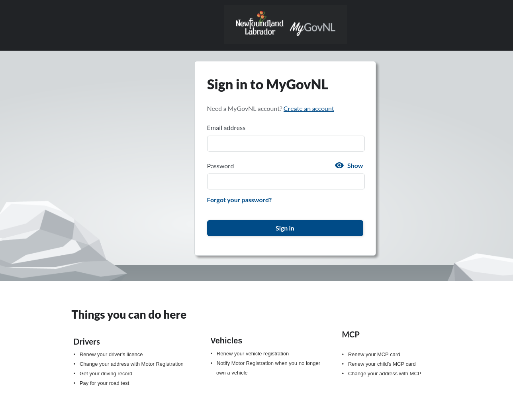
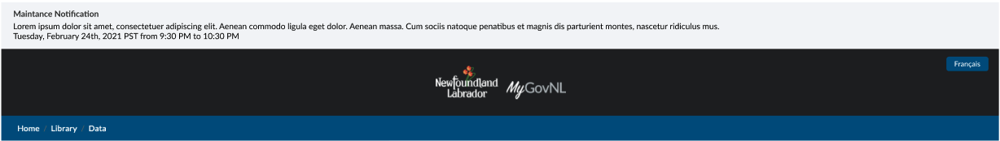
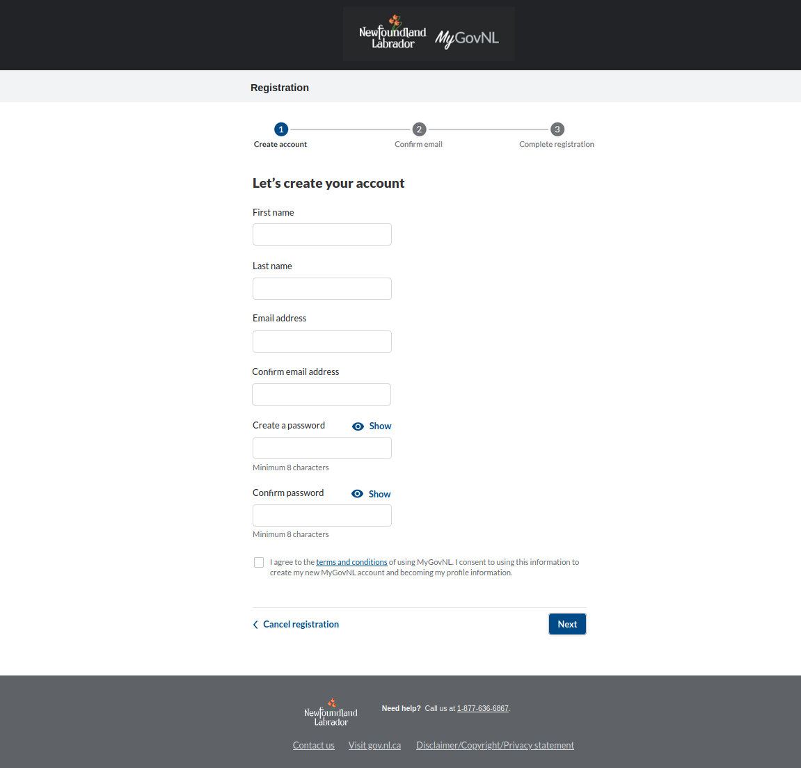

##############
Create Account
##############

******
Login
******

Description
===========

Below is a template for the entrance page/login page with the NFLD treatment.  This file can be found at the project root (pages/index.html). 
This template is the default page rendered when the user requests the fully qualified domain name without any sub context.  

Controller Logic
================

**General Information**

The root controller has a fair bit of logic behind it other than rendering the login dialog below.  Other logic it performs:

1. looks for query arguments such as *client_id* and *goto* parameters for single sign-flow.
2. Creates a tenant identifier so the correct templates are rendered.
3. Sets session identifiers
4. Looks for maintenance messages to be included in the ribbon at the top of the page.
5. Inspects for an active user and redirects to the dashboard page.
6. Looks for a cookie to that defines the prefered language, if none is found it looks are the header request for a declared language.

**Login Dialogue**

The login form on this page accepts two parameters that are sent to the login processor at /{lang}/login 

.. code-block:: JSON

    {
        "usernameOrEmail": string, 
        "password": string 
    }

This controller will either response with an error object, or direct the user to the dashboard page.

**Maintenance Messaging**

Also, when this page is rendered, there is a system call to the maintenance service looking for any upcoming alerts with title and collapsed details,
If there is a response object the following object is available to the template, and the CitizenOne tagging will expose the html component that 
displays the maintenance ribbon.

.. code-block:: JSON

    {
        "maintenanceId": string,
        "title": string,
        "details": string,
        "startDate": string,
        "endDate": string
    }

And makes available to the HTML view the following objects:

.. code-block:: GO 

    type MaintenanceMessage struct {
	MaintenanceId int    `json:"maintenanceId"`
	Title         string `json:"title"`
	Details       string `json:"details"`
	StartDate     string `json:"startDate"`
	EndDate       string `json:"endDate"`
    }

The if the maintenance object is not empty, it will trigger the logic in the view to display the maintence banner:
*(following code used as an example only)*

.. code-block:: html

    

        
{{ maintenanceMessage.Title }} 

        
{maintenanceMessage.Details

    

**Error Messaging**

There is an error treatment to inform the user that the incorrect information was provided. This template is a re-usable 
template framed to paint errors in a globally common way. This error component is displayed by default just over the username 
input.  This template can be styled to meet your standards. The default template appears like the following:

and the HTML code that renders the error state (is also the success state) is as follows:

.. code-block:: html

    {{if .flash.success}}
        

            {{.flash.success}}
        

        {{end}}

        {{if or .errors .flash.error .e}}
        

            <h3 class="text-danger">Error, there was an issue processing that request</h3>
            
More details may be found below

            {{ .flash.error }}
            <ul style="margin-top:10px;">

                {{range .errors}}
                    <li>{{.}}</li>
                {{end}}
                {{range .e}}
                    <li>{{.}}</li>
                {{end}}
            </ul>
        

**Language Toggle**

If there is a requirement for multiple languages, this is satisifed by various ways:

1. The platform inpects for a set language cookie and sets the language accordingly
2. The platform inspects the URL route for the language parameter and sets accordingly
3. The platform looks at the header request and respects the language paremeter, and sets accordingly

This toggle control can be a button, image, text link anything that can take a dynamic contruction of injecting 
a HTML view argument of {{ lang }

For example:

.. code-block:: HTML

    

    <a href="/{{ .lang }} /login"> {{ lang .lang }} </a>
    

*******************
Create Account
*******************

When the user fills the form and clicks on "Continue" a confirmation email is being sent, and the user is being informed with "Check your email" screen

****************
Check Your Email
****************

******************
Email being sent:
******************

    Hi Bea,

    You recently created a MyGovNL Account.

    Click this link to sign in and activate your MyGovNL Account.

    If the above link is not clickable, copy and paste this link into your web browser's address bar:

    https://gov.nl.ca/#/activate/5hpfhp6qqk9875vlt36m8abc41c2f8du6pc67c74m5j6kth9

    Regards,

    Government of Newfoundland and Labrador

    This message including attachments was sent to bea@vivvo.com for a specific recipient. If you are not the intended recipient, any redistribution or copying of this message is prohibited. If you have received this email in error, please let us know immediately, and delete this email.